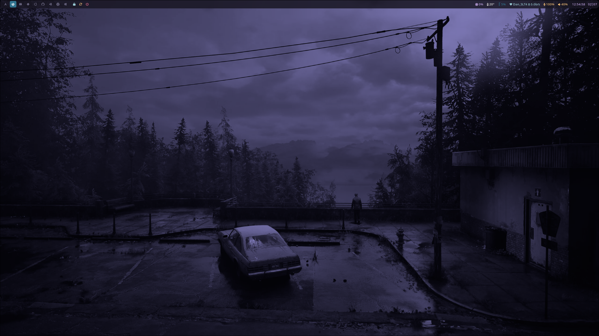

# 🌿 Dotfiles – Arch + Hyprland Setup

Welcome to my personal dotfiles setup!  
This repo is built for [EndeavourOS](https://endeavouros.com/) / Arch Linux using the [Hyprland](https://github.com/hyprwm/Hyprland) Wayland compositor.  

---

## ⚙️ Features

- Includes configurations for:
  - `nvim`: [Code Editor](https://neovim.io/)
  - `zsh`: [Shell](https://www.zsh.org/)
  - `zellij`:  [Terminal Workspace](https://zellij.dev/)
  - `hyprland`: [Compositor](https://hyprland.org/)
  - `waybar`: [Bar](https://github.com/Alexays/Waybar)
  - `wofi`: [App Launcher](https://hg.sr.ht/~scoopta/wofi)
  - `ghostty`: [Terminal](https://ghostty.org/)

---

## 📦 Dependencies

Make sure you have the following tools installed before running the setup:

```bash
# Oh my zsh
sh -c "$(curl -fsSL https://raw.githubusercontent.com/ohmyzsh/ohmyzsh/master/tools/install.sh)"
git clone https://github.com/zsh-users/zsh-autosuggestions ${ZSH_CUSTOM:-~/.oh-my-zsh/custom}/plugins/zsh-autosuggestions
git clone https://github.com/zsh-users/zsh-syntax-highlighting.git ${ZSH_CUSTOM:-~/.oh-my-zsh/custom}/plugins/zsh-syntax-highlighting

# Arch-based
sudo pacman -S zsh hyprland wofi waybar stow git eza ghostty zellij lazygit
yay -S hyprshot swaync hyprlock hypridle hyprpaper starship

# fzf and fd
sudo pacman -S fzf fd

# gtk theme
yay -S nwg-look
yay -Sy catppuccin-gtk-theme-mocha

# fonts
yay -S ttf-jetbrains-mono
sudo pacman -S ttf-font-awesome ttf-nerd-fonts-symbols

# Starting ssh agents
systemctl --user enable ssh-agent
systemctl --user start ssh-agent

ssh-add ~/.ssh/...
```

## 🖼️ Showcase



